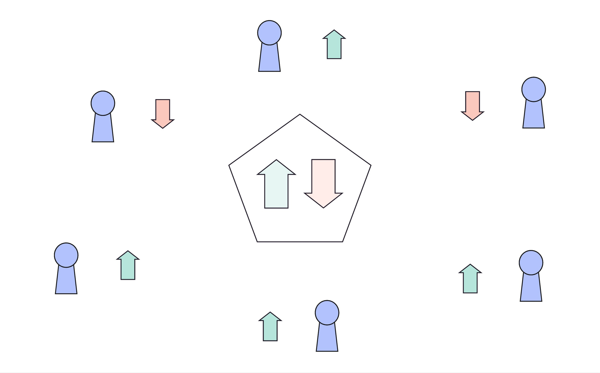

# Paladin Governance Program

<a href="https://github.com/paladin-bladesmith/governance-program/actions/workflows/main.yml"></a>
<a href="https://explorer.solana.com/address/Dbf7u6x15DhjMrBMunY3XoRWdByrCCt2dbyoPrCXN6SQ"></a>
<a href="https://www.npmjs.com/package/@paladin-bladesmith/governance"></a>
<a href="https://crates.io/crates/paladin-governance-program-client"></a>



The Paladin Governance program facilitates the creation and management of
governance proposals. Proposals can be created by any Paladin staker and can
contain one or more Solana instructions to gatekeep. Proposals are voted on by
stakers and can be executed if they reach a quorum of votes.

A global configuration is used to set certain parameters for governance
operations, including the minimum stake support required for a proposal to be
accepted or rejected, the voting time period, and more.

## Architecture

The global configuration - the Governance Config - can be set using the
program's `InitializeGovernance` instruction and updated using the program's
`UpdateGovernance` instruction. Updating an existing governance configuration
can only be done through an accepted governance proposal.

```rust
struct GovernanceConfig {
    /// The cooldown period that begins when a proposal reaches the
    /// `proposal_acceptance_threshold` and upon its conclusion will execute
    /// the proposal's instruction.
    pub cooldown_period_seconds: u64,
    /// The minimum required threshold (percentage) of proposal acceptance to
    /// begin the cooldown period.
    ///
    /// Stored as a `u32`, which includes a scaling factor of `1e9` to
    /// represent the threshold with 9 decimal places of precision.
    pub proposal_acceptance_threshold: u32,
    /// The minimum required threshold (percentage) of proposal rejection to
    /// terminate the proposal.
    ///
    /// Stored as a `u32`, which includes a scaling factor of `1e9` to
    /// represent the threshold with 9 decimal places of precision.
    pub proposal_rejection_threshold: u32,
    /// The signing bump seed, used to sign transactions for this governance
    /// config account with `invoke_signed`. Stored here to save on compute.
    pub signer_bump_seed: u8,
    _padding: [u8; 7],
    /// The Paladin stake config account that this governance config account
    /// corresponds to.
    pub stake_config_address: Pubkey,
    /// The voting period for proposals.
    pub voting_period_seconds: u64,
}
```

This global configuration dictates the behavior of all proposals created while
this configuration is active. If the configuration changes, newly created
proposals will use the updated configuration, while existing proposals will
continue to use the ruleset that was active when they were created.

This can be observed by considering the account state layout for a proposal,
which stores a local copy of the governance config, added upon creation.

```rust
pub struct Proposal {
    discriminator: [u8; 8],
    /// The proposal author.
    pub author: Pubkey,
    /// Timestamp for when the cooldown period began.
    ///
    /// A `None` value means cooldown has not begun.
    pub cooldown_timestamp: Option<NonZeroU64>,
    /// Timestamp for when proposal was created.
    pub creation_timestamp: UnixTimestamp,
    /// The governance config for this proposal.
    pub governance_config: GovernanceConfig,
    /// Amount of stake that did not vote.
    pub stake_abstained: u64,
    /// Amount of stake against the proposal.
    pub stake_against: u64,
    /// Amount of stake in favor of the proposal.
    pub stake_for: u64,
    /// Proposal status
    pub status: ProposalStatus,
    _padding: [u8; 7],
    /// The timestamp when voting began.
    pub voting_start_timestamp: Option<NonZeroU64>,
}
```

## Proposal Creation

The program requires a valid Paladin stake account to create a new proposal.
Once created, a proposal can support a list of instructions that are to be
executed if and when the proposal is accepted. The proposal author can add
(push) and remove instructions using the `PushInstruction` and
`RemoveInstruction` instructions, respectively.

```rust
pub enum PaladinGovernanceInstruction {
    /* ... */
    /// Insert an instruction into a governance proposal.
    ///
    /// Expects an initialized proposal and proposal transaction account.
    ///
    /// Authority account provided must be the proposal creator.
    ///
    /// Accounts expected by this instruction:
    ///
    /// 0. `[s]` Paladin stake authority account.
    /// 1. `[ ]` Proposal account.
    /// 2. `[w]` Proposal transaction account.
    PushInstruction {
        /// The program ID to invoke.
        instruction_program_id: Pubkey,
        /// The accounts to pass to the program.
        instruction_account_metas: Vec<ProposalAccountMeta>,
        /// The data to pass to the program.
        instruction_data: Vec<u8>,
    },
    /// Removes an instruction from a governance proposal.
    ///
    /// Authority account provided must be the proposal creator.
    ///
    /// Accounts expected by this instruction:
    ///
    /// 0. `[s]` Paladin stake authority account.
    /// 1. `[ ]` Proposal account.
    /// 2. `[w]` Proposal transaction account.
    RemoveInstruction {
        /// The index of the instruction to remove.
        instruction_index: u32,
    },
    /* ... */
}
```

Instructions are serialized into a vector, stored in an account adjacent to the
proposal account whose address is the PDA derivation of the string literal
`"proposal_transaction"` plus the address of the proposal.

```rust
struct ProposalInstruction {
    /// The program ID to invoke.
    pub program_id: Pubkey,
    /// The accounts to pass to the program.
    pub accounts: Vec<ProposalAccountMeta>,
    /// The data to pass to the program.
    pub data: Vec<u8>,
    /// Whether the instruction has been executed.
    pub executed: bool,
}
```

Whenever the author is ready to commence voting on their proposal, the
instruction `BeginVoting` will finalize the proposal, making its contents
and instruction set immutable. This also configures the proposal's stage to
`Voting`, which means votes can be cast and tallied on the proposal.

## Voting

Each given stake account can vote either in favor or against a proposal, but
the absence of a vote can also be tallied, if so desired.

```rust
enum ProposalVoteElection {
    /// Validator did not vote.
    DidNotVote,
    /// Validator voted in favor of the proposal.
    For,
    /// Validator voted against the proposal.
    Against,
}
```

The `Vote` instruction allows a new vote, and expects no prior vote for this
proposal to exist, while `SwitchVote` allows a stake account to modify their
vote and expects a prior vote. Votes are stored in a PDA account, whose address
is the derivation of the string literal `"proposal_vote"` plus the stake
address and the proposal address. This, of course, means one stake account can
have one vote PDA per proposal.

### Cooldown Period

Paladin Governance voting makes use of a "cooldown" mechanism for finalizing
vote tallies. When the votes in favor of the proposal reach the
`proposal_acceptance_threshold` set by the governance config, a cooldown timer
is started. When the cooldown timer expires, the proposal is marked as
accepted.

The only way a proposal in cooldown can be rejected is if the votes shift by a
large enough margin to push the votes against the proposal past the
`proposal_rejection_threshold`. In this case, the proposal is rejected.

Regardless of cooldown, if a proposal's votes against push beyond the
`proposal_rejection_threshold`, the proposal is rejected.

The cooldown period cannot be reset once it begins. The proposal will result in
either `Accepted` or `Rejected` as the result of an initiated cooldown period.

Voting is also restricted to a global voting period, set by the governance
configuration, which will terminate a proposal as `Rejected` if a cooldown is
never reached. If the vote period ends while a cooldown is active, the cooldown
period will be allowed to finish. In other words, all cooldown periods have a
constant time period, as determined by the governance config.

## Processing Accepted Proposals

Once a proposal has been accepted, its instructions can be processed. Many
instructions, such as a transfer from the governance treasury, require the
Governance PDA signer's signature in order to successfully execute. An accepted
proposal is the only way to obtain such a signature.

Users can invoke the Paladin Governance program's `ProcessIntruction`
instruction with the index of the proposal instruction to process. This will
process the desired serialized instruction via CPI, applying the governance PDA
signature.

Note: Proposal instructions must be processed in order, and if the previous
instruction has not been executed, attempting to process an instruction will
result in an error. In other words, in order to process any instruction, its
parent instruction must have been processed successfully. If an instruction
cannot be processed successfully, the proposal will have to be re-created
and accepted once again in order to retry.